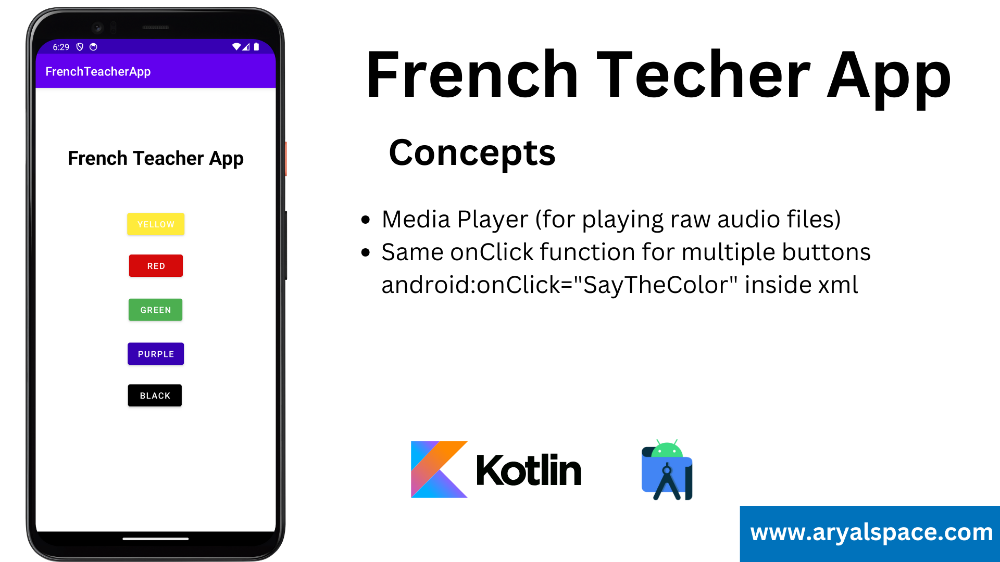

# French Teacher App




In the code you provided, the `SayTheColor` function appears to be defined but is not explicitly called within the `onCreate` method or any other part of the code. However, it is likely intended to be used as an event handler for UI elements like buttons in an Android layout XML file.

The key to understanding how this function works is the `onClick` attribute, which is not shown in the code you provided. To make the function work, you need to associate it with a specific UI element in your XML layout file. Here's how you typically do it:

1. **XML Layout File (`activity_main.xml`):** In your layout XML file, you would define UI elements like buttons and specify their attributes. To associate the `SayTheColor` function with a button, you need to set the `android:onClick` attribute to the name of the function.

   Example XML for a button:

   ```xml
   <Button
       android:id="@+id/colorButton"
       android:layout_width="wrap_content"
       android:layout_height="wrap_content"
       android:text="Click Me"
       android:onClick="SayTheColor"
       android:tag="color_audio_file" />
   ```

    - `android:onClick="SayTheColor"`: This attribute tells Android that when this button is clicked, it should call the `SayTheColor` function.
    - `android:tag="color_audio_file"`: This attribute can be used to associate some data (in this case, an identifier for an audio file) with the button. The `SayTheColor` function uses this tag to determine which audio file to play.

2. **In the Java/Kotlin Code:** Once you've set up the `android:onClick` attribute in your XML layout file, Android will automatically associate the `SayTheColor` function with the button. When the button is clicked, Android will call the `SayTheColor` function, passing in the `View` object of the button that was clicked. This is how the function is invoked, even though it's not explicitly called in your code.

In summary, the `SayTheColor` function is intended to be used as a click event handler for UI elements in your Android app. By setting the `android:onClick` attribute in your XML layout file, Android automatically invokes this function when the associated UI element (e.g., a button) is clicked.